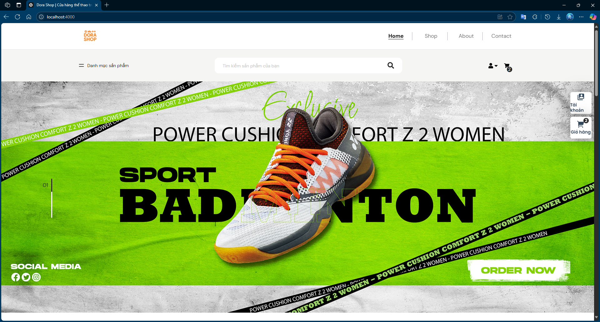
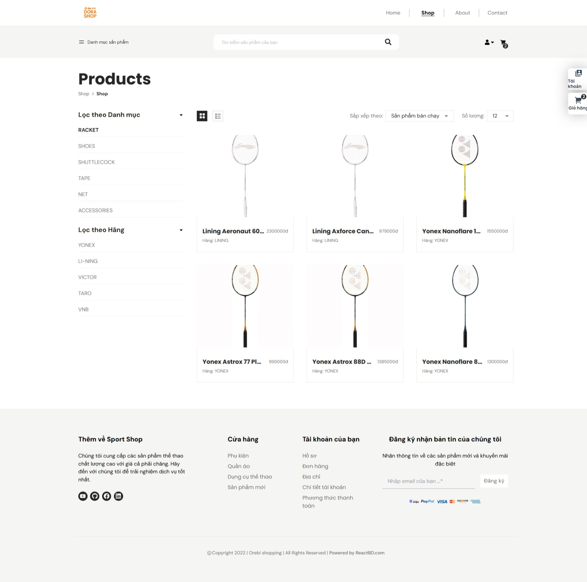
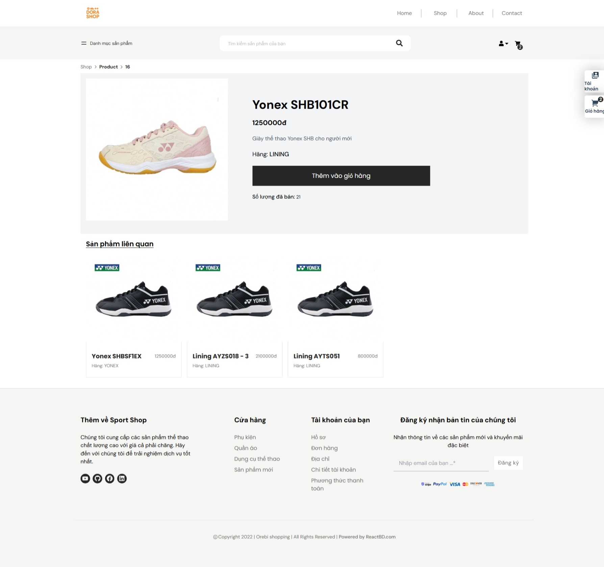
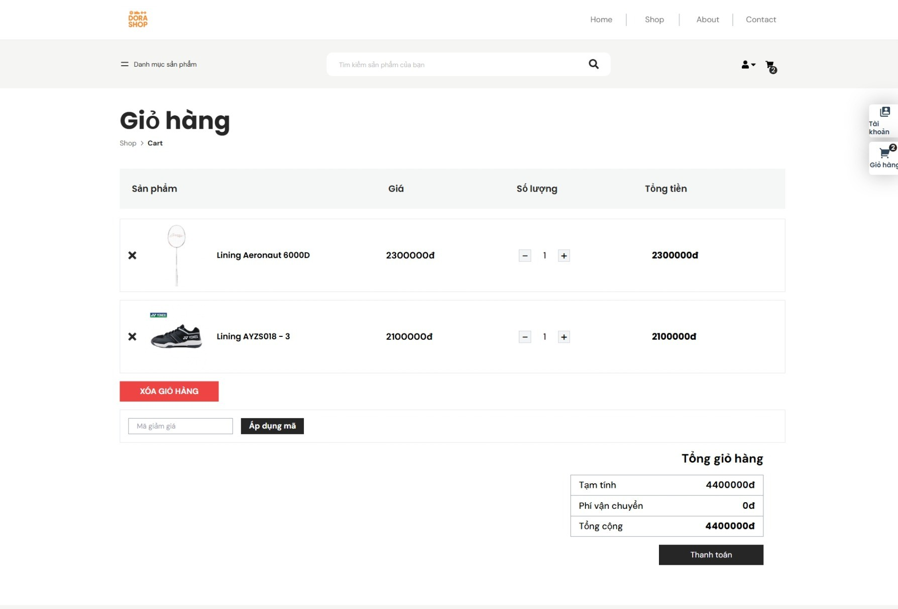
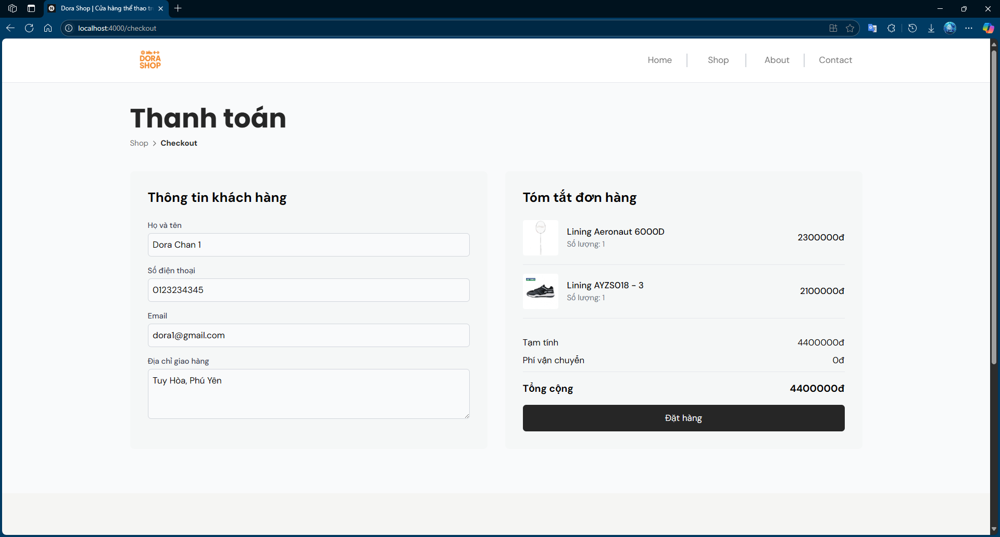
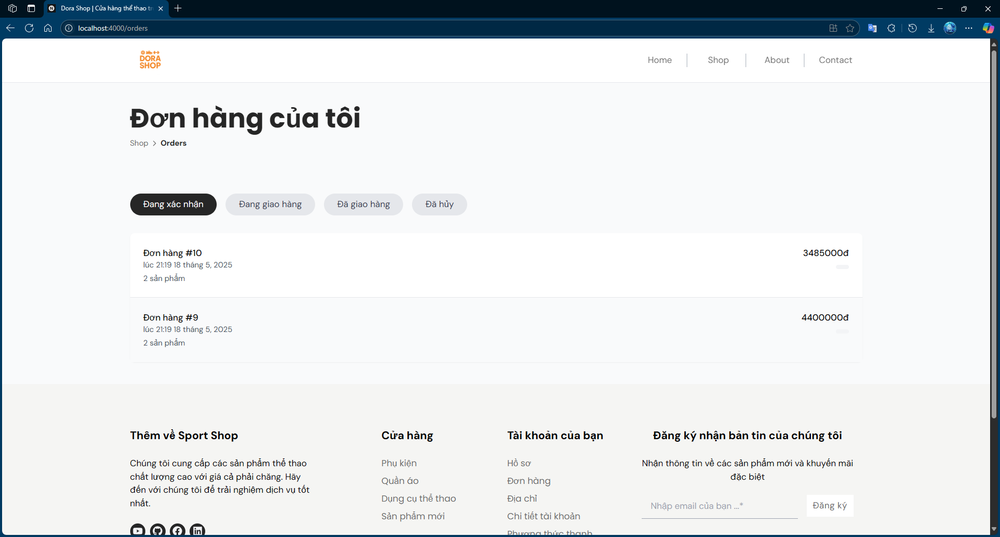
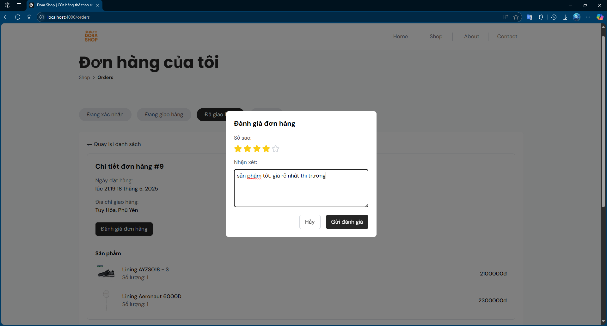
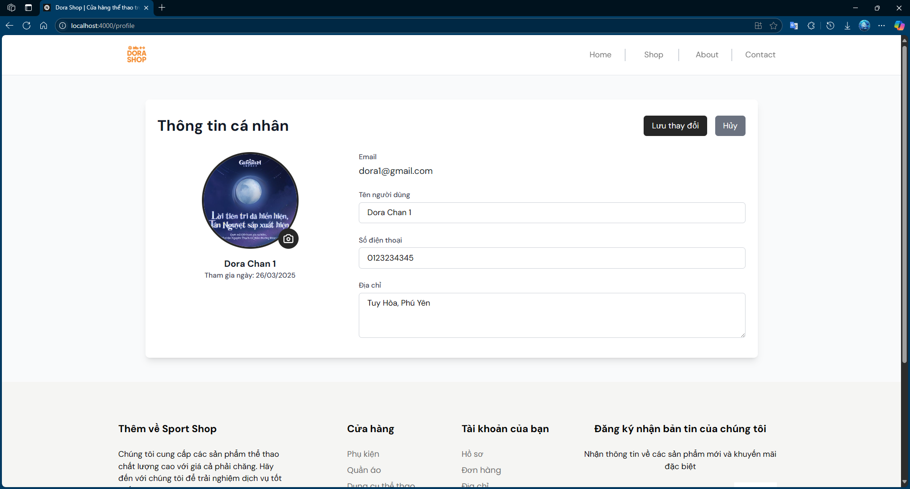

# DORA Shop - Sports Equipment E-commerce Website

## Introduction

DORA Shop is a modern e-commerce platform specializing in sports equipment, built with cutting-edge technologies and a user-friendly interface. This project is inspired by and references the [Orebi Shopping](https://github.com/noorjsdivs/orebishopping) repository, adapting and enhancing its features for our specific use case.


_Welcome to Dora Shop - Your Ultimate Sports Equipment Destination_

## Technologies Used

### Backend

- Node.js
- Express.js
- Sequelize ORM
- MySQL
- JWT (JSON Web Token) for authentication
- Bcrypt for password hashing

### Frontend

- React.js
- Redux for state management
- Tailwind CSS for styling
- React Router for navigation
- Axios for HTTP requests

## Key Features

### User Features

#### Product Browsing


_Browse through our extensive collection of sports products_

#### Product Details


_Detailed product information and specifications_

#### Shopping Cart


_Manage your shopping cart and review items_

#### Checkout Process


_Secure and easy checkout process_

#### Order Management


_Track your order status_


_View detailed order information_

#### User Profile


_Manage your personal information and preferences_

### Security Features

- JWT Authentication
- Password Encryption
- User Role Management
- Protected API Routes

## Installation and Setup

### System Requirements

- Node.js (version 14.0.0 or higher)
- MySQL (version 8.0 or higher)
- npm or yarn

### Backend Installation

```bash
cd server
npm install
```

### Frontend Installation

```bash
cd client
npm install
```

### Configuration

1. Create the environment variables file for server:

```bash
cd server
touch .env
```

2. Add the following configuration to your `.env` in server:

```env
#app port
PORT = 3000 || your_server_port
#app hostname
HOST_NAME = localhost || your_server_host_name

#database config
DB_PORT = your_database_port
DB_NAME = express_shop_db
DB_USER = your_database_username
DB_PASSWORD = your_database_password

#jwt secret key
SECRET_KEY = your_secretkey

#mail config
EMAIL_USER = your_email
EMAIL_PASS = your_email_application_pass
```

3. Create the environment variables file for client:

```bash
cd client
touch .env
```

4. Add the following configuration to your `.env` in client:

```env
PORT = 4000 || your_client_port

# Back end server host
REACT_APP_API_HOST=http://127.0.0.1:3000 || your_server_host
```

### Running the Project

1. Start the server:

```bash
cd server
npm start
```

2. Start the client:

```bash
cd client
npm start
```

## Project Structure

```
sport_shop/
├── client/                 # Frontend React application
│   ├── public/            # Static files
│   └── src/               # Source code
│       ├── components/    # React components
│       ├── pages/        # Page components
│       └── redux/        # Redux store and actions
│
└── server/                # Backend Node.js application
    ├── src/
    │   ├── config/       # Configuration files
    │   ├── controllers/  # Route controllers
    │   ├── models/       # Database models
    │   ├── routes/       # API routes
    │   ├── services/     # Business logic services
    │   ├── repositories/ # Data access layer
    │   └── middleware/   # Custom middleware
    └── server.js         # Entry point
```

## Contributing

Contributions are welcome! Please feel free to submit a Pull Request or create an issue.

## Author

**Hà Đức Phát**  
Ho Chi Minh City University of Technology and Education
Contact: [hdphat123@gmail.com]

